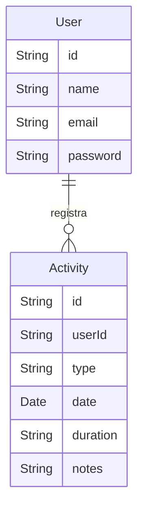

# Projeto PJBL - C4 Model e Tópicos Arc42

## 1. Tópico 1 do Arc42: Escopo e Contexto do Sistema
Esta seção descreve o contexto geral e o escopo do sistema.

### Diagrama de Contexto do Sistema PJBL (C4 Model - Nível 1)
```mermaid
C4Context
title Diagrama de Contexto do Sistema PJBL
Boundary(SystemBoundary_PJBL, "Sistema PJBL") {
Person(User, "Usuário Final")
Person(Admin, "Administrador")
System(PJBL_System, "PJBL", "Rastreador de Atividades Esportivas Personalizável")
User -> PJBL_System: Usa a plataforma para registrar atividades
Admin -> PJBL_System: Gerencia usuários e configurações do sistema
}
```
### Arc42 - Contexto e Restrições
- O sistema permite que os usuários registrem atividades esportivas.
- Administradores são responsáveis pelo gerenciamento de usuários e configurações do sistema.
- Restrições externas incluem regulamentações de privacidade de dados e integração com dispositivos de terceiros.

---

## 2. Tópico 2 do Arc42: Estratégia de Solução
Esta seção descreve a estratégia de alto nível de como a solução foi construída.

### Tecnologias e Arquitetura
- **Frontend**: ReactJS para uma interface moderna e responsiva.
- **Backend**: Node.js para desenvolvimento de APIs e Python para análise de dados.
- **Banco de Dados**: MongoDB para armazenar os dados de atividades dos usuários.
- **Nuvem**: Implantado no Azure para escalabilidade e confiabilidade.

---

## 3. Tópico 3 do Arc42: Blocos de Construção
Esta seção fornece uma visão geral dos principais blocos de construção do sistema.

### Diagrama de Contêineres do Sistema PJBL (C4 Model - Nível 2)
```mermaid
C4Container
title Diagrama de Contêineres do Sistema PJBL
Person(User, "Usuário Final")
Person(Admin, "Administrador")
System_Boundary(PJBL_System, "PJBL") {
Container(WebApp, "Aplicação Web", "ReactJS", "Interface do usuário para registrar atividades")
Container(API, "API Backend", "Node.js", "Gerencia a lógica de negócios e requisições de API")
Container(Database, "MongoDB", "Armazena dados de usuários e atividades")
Container(DataAnalysis, "Módulo de Análise de Dados", "Python", "Analisa dados de atividades dos usuários e gera relatórios")
}
User -> WebApp: Interage com a interface
WebApp -> API: Envia requisições de API para obter dados
API -> Database: Leitura/Escrita de dados dos usuários
API -> DataAnalysis: Dispara tarefas de análise de dados
Admin -> WebApp: Acessa funcionalidades administrativas
```
### Blocos de Construção
- **Aplicação Web**: Frontend baseado em ReactJS que permite aos usuários registrar e visualizar suas atividades.
- **API Backend**: API baseada em Node.js que gerencia toda a lógica de negócios, incluindo autenticação e registro de atividades.
- **Banco de Dados**: MongoDB como o principal repositório de dados para usuários, atividades e relatórios.
- **Módulo de Análise de Dados**: Scripts e bibliotecas em Python que analisam os dados de atividades e produzem relatórios para os usuários.

## 4. Tópico 4 do Arc42: Diagrama de Entidade e Relacionamento


## 5. Tópico 5 do Arc42: C4 Model - Nível 3
```mermaid
C4Component
title Diagrama de Componentes do Sistema PJBL
Container(API, "API Backend", "Node.js", "Gerencia a lógica de negócios e requisições de API") {
    Component(AuthService, "Serviço de Autenticação", "Node.js", "Gerencia a autenticação e autorização dos usuários")
    Component(ActivityService, "Serviço de Atividades", "Node.js", "Gerencia o registro e consulta de atividades esportivas")
    Component(DataAnalysisService, "Serviço de Análise de Dados", "Python", "Executa análise de dados e gera relatórios")
    Component(Database, "Banco de Dados", "MongoDB", "Armazena dados de usuários e atividades")
}
User -> AuthService: Autentica
User -> ActivityService: Registra atividades
ActivityService -> Database: Grava dados de atividades
ActivityService -> DataAnalysisService: Solicita análise de dados
```

---

## 6. Arc42: ATAM (Architecture Tradeoff Analysis Method)

### Objetivo do ATAM
O método ATAM foi utilizado para avaliar a arquitetura do sistema PJBL, identificando pontos de decisão e possíveis trade-offs que afetam as qualidades do sistema, como desempenho, segurança e manutenibilidade. Abaixo estão alguns pontos avaliados e discutidos:

1. **Desempenho (10)**
   - A arquitetura utiliza o MongoDB, que é escalável e possui uma alta performance para leituras e escritas rápidas, beneficiando a responsividade do sistema.
   - Para atender à alta demanda de usuários simultâneos, o backend em Node.js permite um alto número de requisições assíncronas, proporcionando um bom desempenho.

2. **Segurança (7)**
   - A API Backend possui um serviço de autenticação (AuthService) que gerencia autenticação e autorização dos usuários, protegendo o sistema contra acessos não autorizados.
   - O MongoDB é configurado com permissões e autenticação para evitar acessos indevidos aos dados dos usuários.

3. **Manutenibilidade (4)**
   - O uso de micro-serviços para o backend (como serviços separados para autenticação, atividades e análise de dados) facilita a manutenção do código, permitindo que alterações em uma área específica não afetem outros módulos.
   - A divisão clara entre frontend (ReactJS) e backend (Node.js e Python) facilita o desenvolvimento independente de cada parte.

4. **Escalabilidade (0)**
   - Utilizar o Azure como provedor de nuvem possibilita a escalabilidade horizontal do sistema, especialmente para o backend em Node.js, permitindo aumentar os recursos conforme a demanda de uso.
   - Escalabilidade é um dos objetivos de longo prazo, mas não é prioritário no momento inicial do projeto, dado o foco no lançamento do MVP (Minimum Viable Product).

---

## 7. Arc42: ARC Quality Goals (Metas de Qualidade)

### Metas de Qualidade Arquitetural

1. **Usabilidade**
   - O sistema deve ser fácil de usar e intuitivo para o usuário final, permitindo o rápido registro e consulta de atividades esportivas.
   - A interface em ReactJS visa proporcionar uma experiência responsiva e fluida, adaptando-se a diferentes dispositivos (desktop e mobile).

2. **Confiabilidade**
   - O sistema deve garantir que os dados dos usuários sejam armazenados e acessíveis de forma consistente, com mecanismos de recuperação de falhas.
   - MongoDB é configurado para suportar redundância de dados, minimizando o risco de perda.

3. **Escalabilidade**
   - A arquitetura precisa suportar a escalabilidade para que o sistema acomode uma quantidade crescente de usuários, conforme o aplicativo se populariza.
   - O backend em Node.js e a hospedagem em nuvem (Azure) são selecionados para facilitar essa escalabilidade.

4. **Segurança**
   - A proteção dos dados dos usuários é uma prioridade, principalmente por envolver dados pessoais e de atividades.
   - A API de autenticação (AuthService) garante que apenas usuários autorizados acessem as funcionalidades e os dados do sistema.

5. **Eficiência**
   - A arquitetura deve permitir um desempenho adequado, garantindo tempos de resposta rápidos para os usuários durante o registro de atividades e a visualização de relatórios.
   - A utilização de Node.js para o backend e Python para análise de dados fornece uma combinação eficiente para processar e analisar dados rapidamente.
